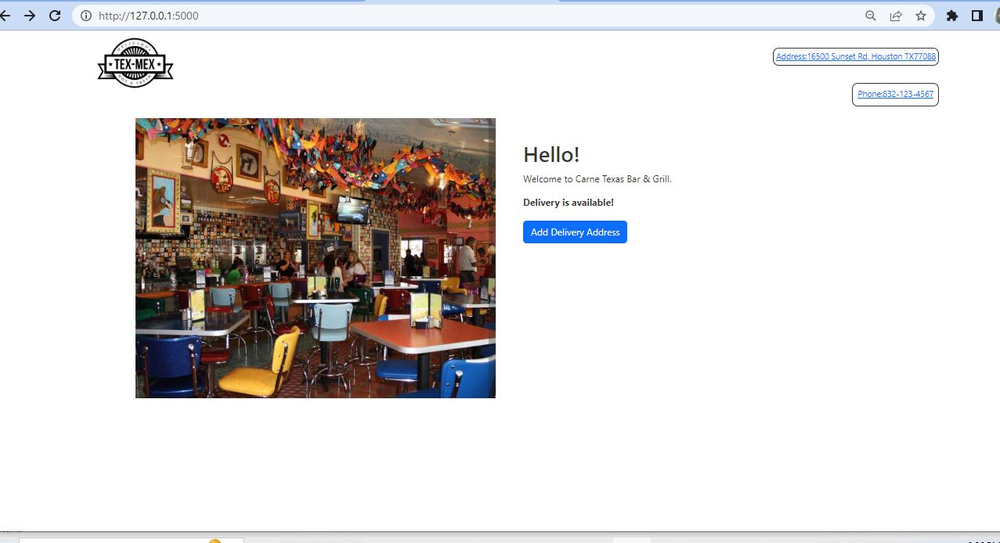
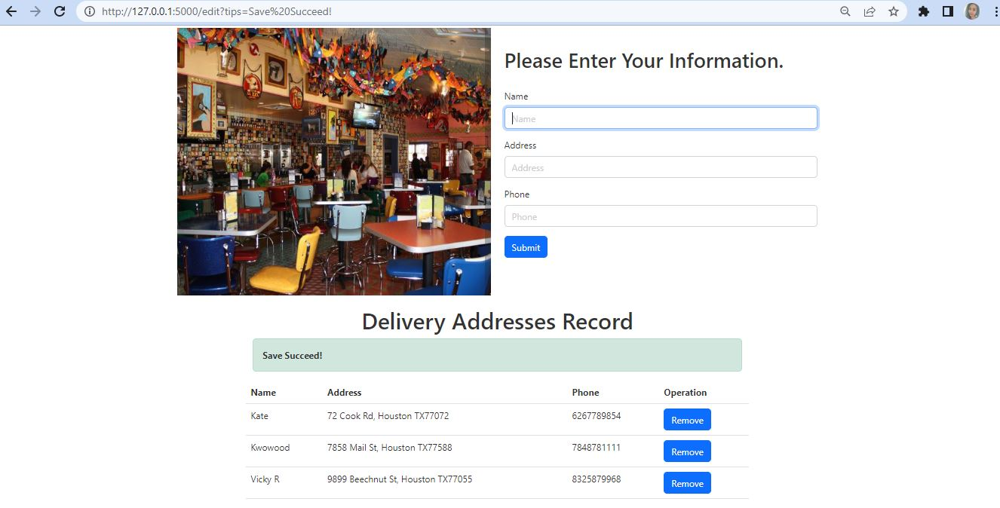

# Django-DeliveryAddressForm

Welcome to my restaurant delivery form project! This project provides a simple way for customers to input their delivery details when placing orders for food delivery from Carne Texas Bar&Grill restaurant. The project allows customers to add and remove their delivery address information by using HTML for the user interface and Django Python for handling the server-side logic.

# Installation instructions
#### Dependencies
Before installing this project, please ensure that you have installed the following software and dependencies:

Python 3.x (recommended to use the latest version)

pip (Python Package Manager)

#### Installation steps
1. Clone project to local:

```cmd
git clone https://github.com/Jieming01/Django-DeliveryAddress.git
```

2. Enter the project directory:

```cmd
cd Django-DeliveryAddress
```

3. Install dependencies:

```cmd
pip install django==4.2
```

4. Migration database:

```cmd
python manage.py migrate
```

5. Start development server:

```cmd
python manage.py runserver
```

6. Open the following link in the browser `http://127.0.0.1:8000` to view the project.


# How to use

#### Accessing the homepage

1. If you successfully run the website, you should see the following screen：

   

   + You can view the store's contact information on the homepage.
   + Click on the "Add Delivery Address" button to jump to the ordering page.

2. Ordering page:

   

   + On the reservation page, you can see a list of current reservation information.
   + Enter your reservation information and click the "Save" button to submit your reservation information.
   +If you want to delete the reservation information, find the reservation information you want to delete and click the "Delete" button to delete it.

# Project Development Description

#### Database section (models.py):

We have defined a `Person` model that includes three fields: `name`, `phone`, and `address`. We use `CharField` to define a character field that can specify the maximum length. In this example, the maximum length of both the `name` and `phone` fields is 30, while the maximum length of the `address` field is 200.

We also defined a`__ str__ Method, which returns the name of the model. When using the Django Admin management interface, this method can help us more easily identify model instances.

#### Request processing (views.py):

1. Home page(GET method):

   We use the `render` function to render a template named `index.html`. Provide a button to jump to the booking page while displaying store contact information to users

2. View reservation information(GET method)：

   Display templates for all reservation information and provide functions for adding and deleting reservation information on the page

3. Delete information(GET method)：

   According to the ID of the reservation information, delete the corresponding reservation information from the database, redirect to the viewing reservation information page, and issue a successful deletion prompt message.

4. Submit information(POST method)：

   Receive the reservation information form submitted by the user, save it to the database, then redirect to the view reservation information page, and issue a successful addition prompt message.
